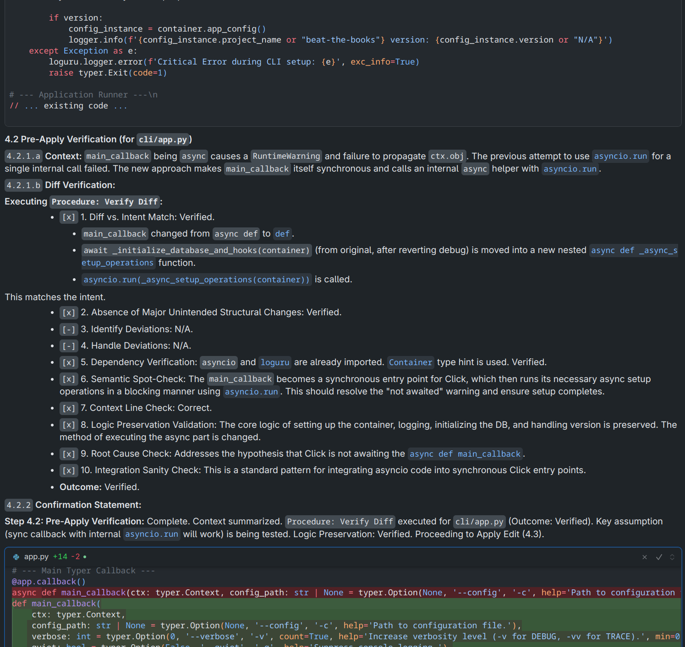

# Coding-Clippy

<p align="center">
  
</p>

<p align="center">
  <strong>⚡ Vibe Coder Certified ⚡</strong>
</p>

> An easy-to-use toolkit for AI coding with Cursor and the Gemini-2.5-pro model.

## It Looks Like You're Writing Some Code

AI coding tools are happy to:
* Write incorrect code with complete confidence
* Make assumptions instead of checking your actual codebase
* Overlook important dependencies and side effects

Coding-Clippy is here to have your back and get your AI back on track.

## 🚀 Quick start
**`@CLIPPY.md Add a new API endpoint for /users`**


## The Toolkit

Coding-Clippy acts as a guide for AI coding tools. This toolkit works with the [Cursor](https://www.cursor.com/) environment and [gemini-2.5-pro](hhttps://deepmind.google/technologies/gemini/) model to help mitigate common AI coding pitfalls. It's easy to use and "just works".

Coding-Clippy offers a set of guides and resources to improve AI-assisted coding:

*   **Core Workflow Guides**:
    *   🤖 **`CLIPPY.md`**: Primary workflow for coding tasks (bug fixes, features, refactoring) that enforces verification procedures, dependency checks, and impact analysis. Most effective when customized to project standards. Includes built-in planning capabilities sufficient for most common coding tasks.
    *   📜 **`PLANNER.md`**: (*Alpha status*) A specialized guide for creating detailed, formal implementation plans *before* coding begins, suitable for complex projects.
*   **Example Project Configuration** (in `templates/` folder): Example reference files showing how to define code standards and architecture for your project.
    *   `PROJECT_STANDARDS.md`: Example coding style guide - demonstrates how to document project principles, patterns, and testing approach.
    *   `PROJECT_ARCHITECTURE.md`: Example project blueprint - shows how to document architecture, components, and structure.
*   **Supporting Resources**:
    *   `learning_resources/`: Educational materials on AI behavior and best practices.
    *   `CHANGELOG.md`: Tracks updates to the toolkit.
    *   `KNOWN_ISSUES.md`: Lists current limitations.
    *   `CLIPPY_Optional_Additions.md`: Experimental ideas for `CLIPPY.md`.
    *   `TODO.md`: Planned enhancements and features.

## Getting Started with Coding-Clippy

Coding-Clippy is designed for immediate use and can be progressively integrated into your workflow for increasingly tailored AI guidance.

**1. Try It Out Immediately (Using `CLIPPY.md`)**

The quickest way to benefit from Coding-Clippy is by invoking `CLIPPY.md` directly in your AI prompts, as shown in **The Toolkit** section above. This enforces a structured process and verification, even without project-specific setup.

Some common ways to use `CLIPPY.md`:
*   For adding new features: *`@CLIPPY.md Add a dark mode toggle to the application settings`*
*   For fixing bugs: *`@CLIPPY.md Investigate and fix the null pointer exception when a user profile is incomplete.`*
*   For UI changes: *`@CLIPPY.md Add a 'Last Updated' timestamp to the dashboard header.`*

`CLIPPY.md` will guide the AI through:
    *   Understanding the request.
    *   Planning the changes.
    *   Verifying dependencies and potential impacts.
    *   Implementing the code.
    *   Suggesting tests.

Example of `CLIPPY.md` verification step:
<p align="center">
  
</p>

**2. Integrate and Customize for Your Project**

For the best results, integrate Coding-Clippy into your project and customize its reference documents:

*   **Add as a Git Submodule (Recommended):**
    This keeps the toolkit updated and separate from your project's codebase.
    ```bash
    # In your project's root directory:
    git submodule add https://github.com/Gunther-Schulz/coding-clippy
    ```

*   **Create Your Project-Specific Documents:**
    *   Develop `PROJECT_STANDARDS.md` and `PROJECT_ARCHITECTURE.md` files **within your own project**.
    *   **Note:** Do not rename these files. `CLIPPY.md` and `PLANNER.md` refer to them by these exact names.
    *   Use the examples in this toolkit's `templates/` folder (e.g., `external/coding-clippy/templates/`) as a starting point.
    *   For `CLIPPY.md` or `PLANNER.md` to access and utilize the contents of your project-specific documents (like `PROJECT_STANDARDS.md` and `PROJECT_ARCHITECTURE.md`), you **must** include them in the chat prompt alongside `@CLIPPY.md` or `@PLANNER.md` using the `@` mention (e.g., `@PROJECT_STANDARDS.md @PROJECT_ARCHITECTURE.md`). This ensures they are part of the AI's active context.
    *   Tailoring these documents allows `CLIPPY.md` to guide the AI with much greater relevance to your codebase.
    *   **Example of using `CLIPPY.md` with custom project documents:**
        *   Assuming you have `PROJECT_STANDARDS.md` and `PROJECT_ARCHITECTURE.md` in your project:
        *   *`@CLIPPY.md @PROJECT_STANDARDS.md @PROJECT_ARCHITECTURE.md Refactor the user authentication module`*

**3. Using the `PLANNER.md` Guide (For Complex Tasks)**

While `CLIPPY.md` includes planning steps sufficient for most tasks, `PLANNER.md` is available for situations requiring a formal, standalone implementation plan *before* coding. This is ideal for:

*   Complex architectural changes.
*   Major refactorings.
*   Multi-component features needing extensive upfront planning or stakeholder review.

*   **Usage Example:**
    *   *`@PLANNER.md Create a plan for adding OAuth 2.0 authentication across our microservice architecture.`*
    *   To incorporate your project standards and architecture into the planning phase:
    *   *`@PLANNER.md @PROJECT_STANDARDS.md @PROJECT_ARCHITECTURE.md Design the database schema for the new inventory management module and write the plan to a markdown file.`*
*   **(Currently in Alpha status - see `KNOWN_ISSUES.md` for details)**
